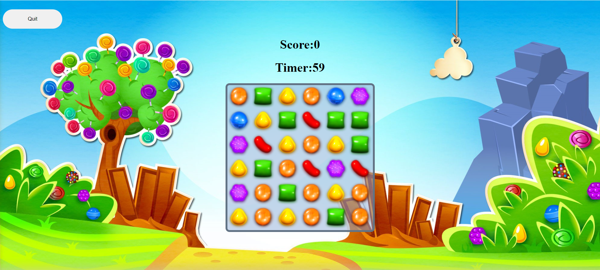
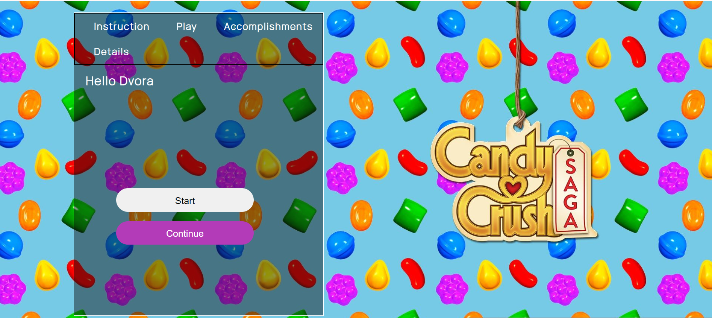

# Candy Crush Game

A fully-functional Candy Crush game developed with JavaScript, HTML, and CSS.

## Features
- Game logic for matching candies
- Scoring system
- User history tracking
- Visually appealing design

## Technologies Used
- JavaScript
- HTML
- CSS

## Installation

1. **Clone the repository**
   ```bash
   git clone https://github.com/Dvora-K/CandyCrush-Game.git
   cd CandyCrush-Game
   ```

2. **Open the `sign-up.html` file in your web browser**

## Game Overview

In this Candy Crush game, you can match candies by swapping adjacent ones to form a row or column of at least three matching candies. The matched candies will disappear, and new candies will fall from the top to fill the empty spaces. The game keeps track of your score and your history in a personalized user area.

## Screenshots




## Contributing

Feel free to fork this repository, create a new branch, and submit a pull request with your improvements.